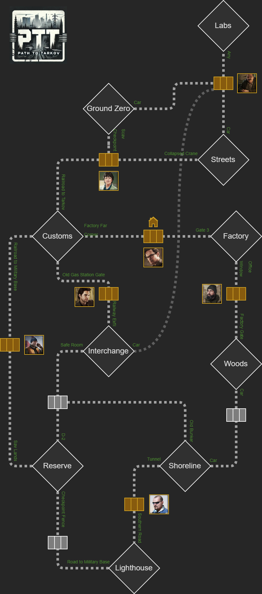

# Path to Tarkov

Connect all available maps through the extracts points, bring a multi-stash system and lock traders according to the player offraid position.


## Description

This mod bring the notion of "offraid position" for the player, it locks certains maps according to this offraid position, change all player spawn points to reflect this positions, change the hideout stash and lock/unlock traders according to the config file.

All corresponding offraid positions, extracts and spawn points can be configured via `config.json` file.

New spawn points can be added in `player_spawnpoints.json`

## Features

- Maps are locked/unlocked according to the offraid position
- Several hideout stash according to your offraid position (disabled in default config)
- Hideout features disabled when player is not on the main stash position
- Traders are available only on certains offraid position
- Tweak exfiltrations points (fixed for each map + removed restrictions)
- Changed spawn points according to the offraid position
- Certains offraid locations enable/disable the hydration/energy/health restoration (according to config)

## The Default configuration



By default, you are on `MechanicStash` offraid position. It means you can spawn on Customs or Factory maps only.

The hideout and the main stash are only accessible on this offraid position.

When player die, the position is reset to the `MechanicStash` position.

Everything is configurable.

## Available Exfiltrations

Here is [the complete list of available exfiltrations points](./ALL_EXFILS.md)

## How to edit the current offraid position

The offraid position is stored in your profile in a dedicated field `PathToTarkov`, you can edit it with a regular text editor.

## UnInstallation

Before deleting the mod, you can set the `enabled` props to `false` in `config.json` and start the server once.

It does 2 things in all existing profiles:

1. Ensure the main stash is selected
2. Unlock all traders listed in the config (Please note Jaeger will be unlocked only if the Introduction quest has been already completed)

## More tweaks

Check the [Path To Tarkov Additions](https://github.com/guillaumearm/PathToTarkovAdditions) mod to setup additional restrictions.

## Modding API

⚠️Since PTT 5.2.0 the modding api is deprecated and disabled by default because any usage of `setConfig`, `setSpawnConfig` or `refresh` will not be guaranteed to work due to the rewrite for Fika.

If you still want to play with it, you can add an option `enable_legacy_ptt_api` in your ptt config set to `true`.

I'll try soon to provide a new better way to change a config dynamically.

Example:

```js
if (!globalThis.PathToTarkovAPI) {
  Logger.error(
    `=> ${this.modName}: PathToTarkovAPI not found, are you sure a version of PathToTarkov >= 2.5.0 is installed ?`,
  );
  return;
}

PathToTarkovAPI.onStart(sessionId => {
  const config = PathToTarkovAPI.getConfig();
  const spawnConfig = PathToTarkovAPI.getSpawnConfig();

  // make some config changes
  config.reset_offraid_position_on_player_die = false;

  PathToTarkovAPI.setConfig(config);
  PathToTarkovAPI.setSpawnConfig(spawnConfig); // not needed if not changed, it's just for the example

  // should be called after setting new configs
  PathToTarkovAPI.refresh(sessionId);
});
```

Full example usage in [Path To Tarkov Additions source code](https://github.com/guillaumearm/PathToTarkovAdditions/blob/master/package.js).
