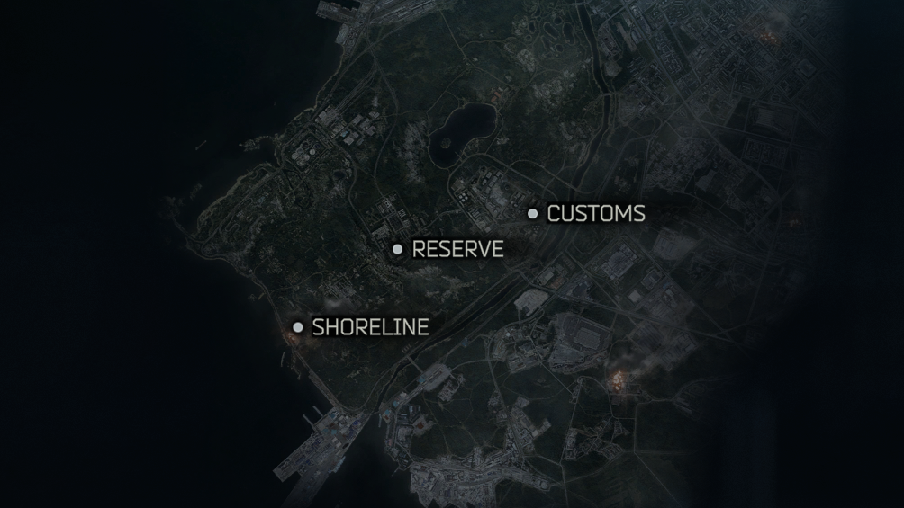
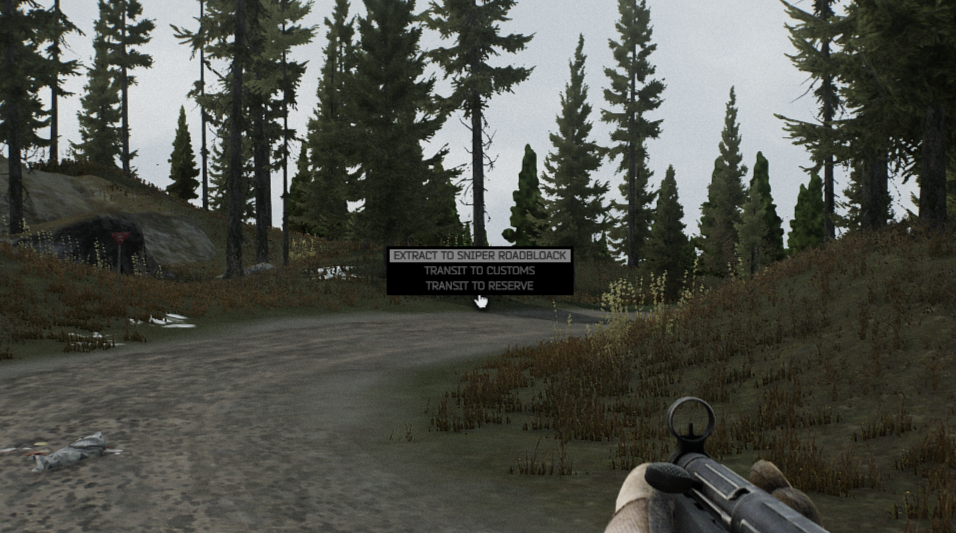
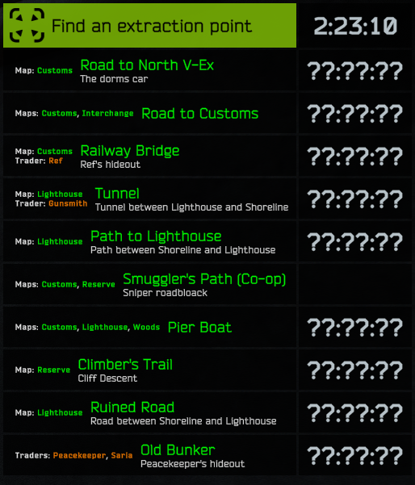
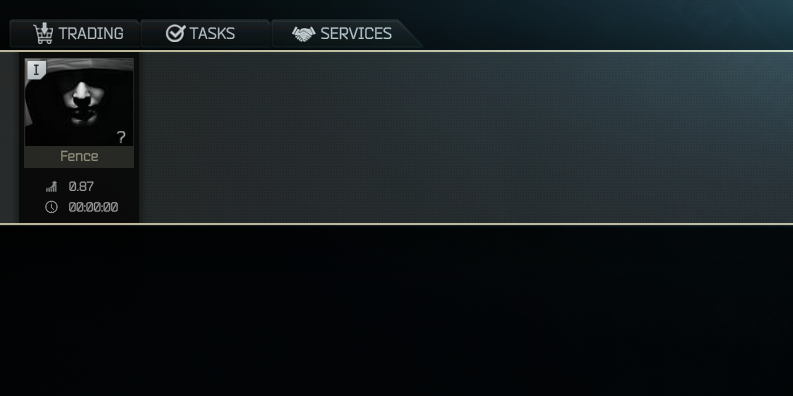
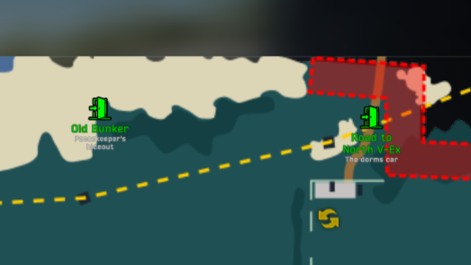
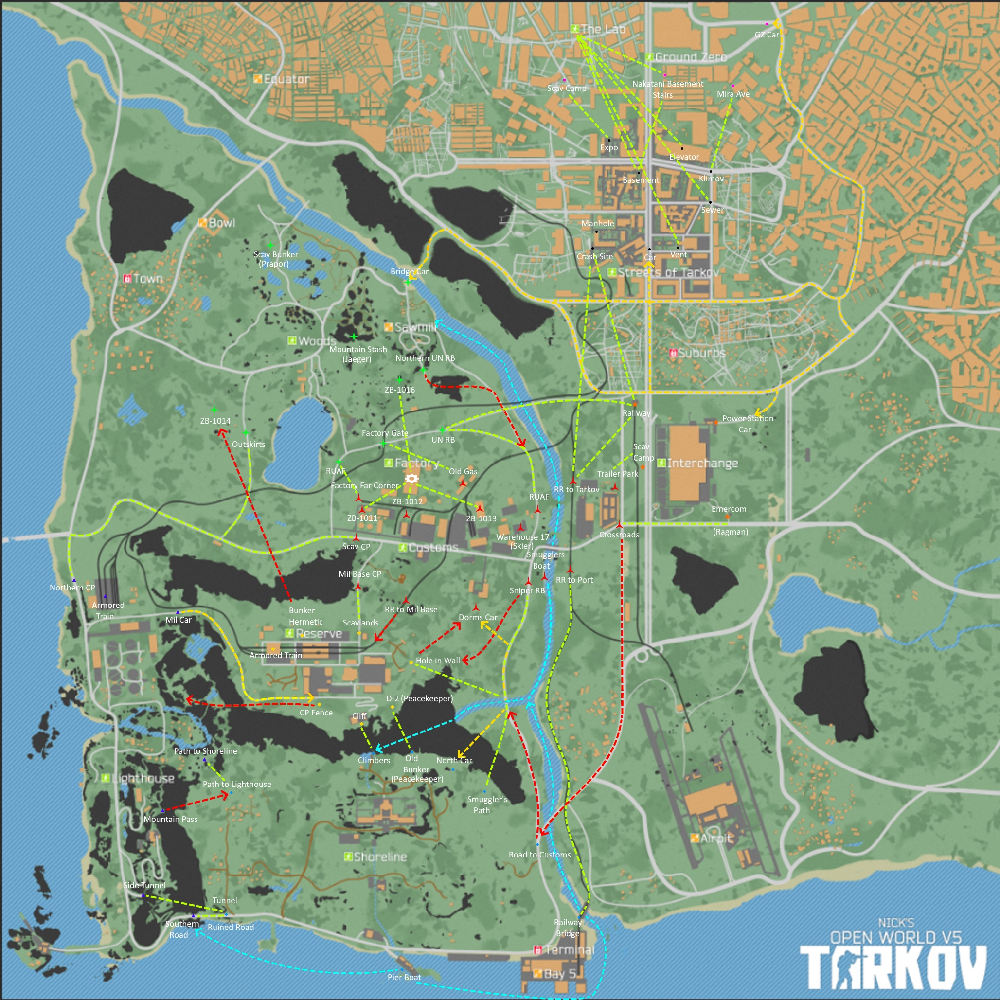

# Path to Tarkov

The Tarkov **open-world experience**. Connect all available maps through the extract points, introduce a multi-stash system, and lock traders according to the player's off-raid position.


## Description

**Path to Tarkov** introduces the concept of "offraid position" for players. This feature locks or unlocks some maps based on the player’s current offraid position. Player spawn points are dynamically adjusted to reflect this position, and hideout stashes and traders are locked or unlocked accordingly, offering a more immersive and strategic gameplay experience.

Players have the freedom to create their own unique paths by customizing offraid positions, extracts, and spawn points.

## Features

- **Dynamic Map Access:** Maps are locked or unlocked based on the player’s offraid position.
- **Customized Spawns:** Spawn points are dynamically adjusted based on the offraid position.
- **Multi-Stash System:** Manage multiple hideout stashes depending on your offraid position (disabled by default).
- **Hideout Restrictions:** Hideout features are disabled when the player is not at the main stash location.
- **Trader Access Control:** Traders are available only at certain offraid positions.
- **Extracts Overhaul:** Exfiltration points allow players to choose between multiple transit options or offraid positions at extracts.
- **Multiplayer compatible:** Path To Tarkov is fully compatible with [Fika](https://github.com/project-fika). Each player has his own offraid position
- **Condition-Based Features:** Certain offraid locations toggle hydration, energy, and health restoration effects, as defined in the configuration.
- **Quality of Life Features:** Players can adjust in-raid restriction limits (for bringing more money during the travel). There is also a FoundInRaid tweak applied by default.
- **Highly customizable:** giving players complete control to adapt and fine-tune their gameplay experience.

## Installation
- [Interactable Exfils API](https://hub.sp-tarkov.com/files/file/2286-interactable-exfils-api/#overview) should be installed
- Like any other mods, you juste have to unpack the zip in your SPT folder.
- For uninstallation, please read about the [uninstallation procedure](./docs/HOW_TO_UNINSTALL.md)

## Recommended mods
- [Dynamic Maps](https://hub.sp-tarkov.com/files/file/1981-dynamic-maps/): is very useful to learn your exfils
- [Leave It There](https://hub.sp-tarkov.com/files/file/2572-leave-it-there/): LIT is the perfect companion for Path To Tarkov, you can place any item in raid and it will persist across multiple raids until you pick it back up!

## Overview

### Dynamic Map Access
This is the main feature of Path To Tarkov: you have to travel between maps.



### Exfils overhaul
You can choose between extraction or transits



### Exfils tooltips overhaul
Tarkov's tooltip template has been reworked to fit the mod.



### Restricted traders
You have to travel to see traders (with modded traders compat)



### Dynamic Maps compatibility
It works nicely with Dynamic Maps



## Path To Tarkov configurations

### The default configuration map images



### Select Your PTT Configuration

The default configuration offers a comprehensive path with all Path to Tarkov features enabled. If it’s your first time using PTT, it is recommended to start with this default setup.

If you wish to explore alternative configurations, the mod includes several pre-configured Path to Tarkov setups. 

To select your current PTT configuration, edit the `Trap-PathToTarkov/configs/UserConfig.json5` file. If this file is missing, start your SPT server once, and the mod will generate it automatically.

You have to update the `selectedConfig` value in your `UserConfig.json5` file to point on an existing configuration:

   ```js
   {
       selectedConfig: "DevilFlippy", // or any other config placed in the `configs` folder
       // ...
   }
   ```

### More reading

- [Frequently Asked Question](./docs/FAQ.md)
- [Planned features](https://github.com/guillaumearm/PathToTarkov/issues?q=is%3Aopen+is%3Aissue+label%3Afeature)
- [Known issues](https://github.com/guillaumearm/PathToTarkov/issues?q=is:open+is:issue+label:bug)
- [Create your config](./docs/HOW_TO_CREATE_CONFIG.md)
- [List of available player spawnpoints](./configs/shared_player_spawnpoints.json5) 
- [List of available vanilla extracts](./ALL_EXFILS.md)
- [Tutorial: create a config from scratch](./docs/TUTORIAL_CONFIG.md)
- [PTT config specification](./docs/SPEC_CONFIG.md)


## How to report a bug
If you want to report a bug, I'll need some details so please [read the HOW_TO_REPORT_A_BUG.md](./docs/HOW_TO_REPORT_A_BUG.md).

## Credits
- Thanks to the SPT team <3
- Thanks to the Fika team <3
- Thanks to [Jehree](https://hub.sp-tarkov.com/user/32691-jehree/) for making Interactable Exfils API
- Thanks to [Jehree](https://hub.sp-tarkov.com/user/32691-jehree/) again to let me re-use the voucher feature from his Traveler mod
- Special thanks to [Jehree](https://hub.sp-tarkov.com/user/32691-jehree/) for getting me into client-side modding
- Thanks to [Fontaine](https://hub.sp-tarkov.com/user/9277-fontaine/) for [his contribution](https://github.com/guillaumearm/PathToTarkov/blob/fdecac5881eeb791661d4c31b9dc7e268546af71/PTT-Extracts/Patch.cs) that bring us a way to allow scav extract to be used by PMCs
- Thanks to [GrooveypenguinX](https://hub.sp-tarkov.com/user/34125-grooveypenguinx/) for the hide traders client-side patch
- Thanks to [rockahorse](https://hub.sp-tarkov.com/user/25630-rockahorse/) and [GrooveypenguinX](https://hub.sp-tarkov.com/user/34125-grooveypenguinx/) for continuing my work with Path To Tarkov Reloaded
- Thanks to [Theta](https://hub.sp-tarkov.com/user/17203-theta/) for making the [first image](./configs/LegacyPathToTarkovV4/PathToTarkovMapV2.3.1.png).
- Thanks to adudewithbadaim for making the [second image](./configs/LegacyPathToTarkovV4/tarkov_full_map2.jpg).
- Thanks to [r1ft](https://hub.sp-tarkov.com/user/11960-r1ft/) for his contribution. (+ old addons mods PTT Extracts Requirements and Dynamic Time Cycle)
- Thanks to [gabe_over](https://hub.sp-tarkov.com/user/18108-gabe-over/) for making [Singler Player Overhaul mod (SPO)](https://hub.sp-tarkov.com/files/file/574-spo-single-player-overhaul).
- Thanks to [Narcotics](https://hub.sp-tarkov.com/user/56420-narcotics/) for [his contributions](https://github.com/guillaumearm/PathToTarkov/pulls?q=is%3Apr+author%3ANarcoticsRx+).
- Thanks to [averyc1876](https://hub.sp-tarkov.com/user/63831-averyc1876/) for the drawio ([last image in PTT 5.2.0](./configs/LegacyPathToTarkovV5/PathToTarkov.png))
- Thanks to everyone else to help me improve the Path To Tarkov experience.

------

If you want to support my work, you can [buy me a coffe​e](https://ko-fi.com/trapcodien).
