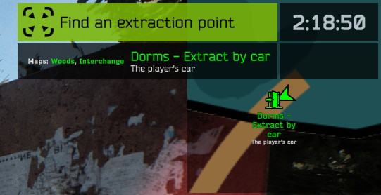
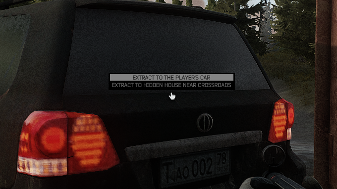

# Path To Tarkov configuration tutorial

In this tutorial, we will make a new config from scratch
and we will see here some of the most common config analysis errors/warnings you may encounter when building your config.

You can find the final config made in this tutorial [here](../configs/Examples/TutorialConfig/config.json5).

## Why a tutorial ?
Since the default config has more than 1000 lines of json, it can be hard to understand the basic principles if you want to start your own config from scratch.

Don't be afraid it will be quite simple if you are already familiar with [json/json5](https://json-5.com/json-vs-json5) format.

## Terminology
- offraid position: fictive place defined in the config, you can name it like you want
- infiltration: target map + player spawnpoint
- exfiltration: in-raid zone when you can perform extract or transit
- extract: stop the game and move the player to a specific offraid position
- transit: load the next map without saving the offraid position

## What we want to achieve in this tutorial
Here we will create a minimal config that will use only few exfils/maps (to keep it simple)

Let's say we want the player starting offraid position be named "The Player's Car" and we'll define it at the main player stash.
From this position, player can go at several place using the car (dorms, interchange, woods)
We'll see in this tutorial how to setup secondary stashes and restrict some traders access based on the offraid positions.
In the end, we will also see how to add a custom transit


## Let's get started

1. Let's start creating a directory called `MyTutorial` in `user/mods/Trap-PathToTarkov/configs` (or whatever the name)
2. Create the file `MyTutorial/config.json5` with this content -> `{}` (yes just this 2 characters, it's an empty json object)
3. Select the `MyTutorial` config in `UserConfig.json5`


At this stage, your empty config `{}` will prevent spt server to start and drop some errors in the console.
This is fine, errors will guide you until you have a valid config
Here is the errors we get on server start:

```
[Path To Tarkov Config] no offraid position found in "infiltrations"
[Path To Tarkov Config] no map found in "exfiltrations"
[Path To Tarkov Config] wrong initial_offraid_position "undefined"
```

Those errors are here to help you, for example if you typo on a exfil name, spawnpoint name or offraid position you'll see errors on server start. So if the server start without error, you're good.


### Fix the first errors

Here you can see the minimum required properties `"infiltrations"`, `"exfiltrations"` and `"initial_offraid_position"`

Ok let's start with a very basic one that will allow you to spawn and extract at dorms (that's basically it)

```js
{
  initial_offraid_position: 'ThePlayerCar',
  infiltrations: {
    ThePlayerCar: {
      bigmap: ['Dorms Car'],
    },
  },
  exfiltrations: {
    bigmap: {
      'Dorms V-Ex': ['ThePlayerCar'],
    },
  },
}
```

Few things to note here:
- `ThePlayerCar` is the name we want to give to the offraid position, we can choose whatever name we want here.
- `ThePlayerCar` is referenced at 3 different places in the above config.
- `Dorms car` is the name of a ptt player spawnpoint, you can find the [full list of ptt player spawnpoints here](../configs/shared_player_spawnpoints.json5)
- `Dorms V-Ex` is the name of a vanilla extract, you can find the [full list of vanilla extracts here](../ALL_EXFILS.md)
- `bigmap` is the name of the map and it correspond to Customs here, please check the Default config to see how maps are named in PTT.

At this point, if we run the server we'll see a warning that say an offraid position is not declared in `offraid_positions`.
This won't prevent you to test your config so you can skip this warning.

However you may want to set a `displayName` for your offraid position and this is exactly the role of `offraid_positions`

Here is the updated config with a displayName for `ThePlayerCar` offraid position:

```js
{
  initial_offraid_position: 'ThePlayerCar',
  infiltrations: {
    ThePlayerCar: {
      bigmap: ['Dorms Car'],
    },
  },
  exfiltrations: {
    bigmap: {
      'Dorms V-Ex': ['ThePlayerCar'],
    },
  },
  offraid_positions: {
    ThePlayerCar: {
      displayName: {
        en: "The player's car",
        // other languages...
      },
    },
  },
}
```

Please note that the default language fallaback is english, if you don't want to break other languages, do not rename the exfil (or consider doing a translation for the desired language)


### Rename the exfil

`Dorms V-Ex` is not a nice name for an exfil, let's rename it using the `exfiltrations_config` property.

We'll add this to the config: 

```js
exfiltrations_config: {
  bigmap: {
    'Dorms V-Ex': {
      displayName: {
        en: "Dorms - Extract by car",
        fr: "Dortoirs - Extraction en voiture",
      },
    },
  },
},
```

### Improve tooltips visual
Now Let's use the `exfiltrations_tooltips_template` feature to make better tooltips that will include offraid position

let's add this to your config: 

```js
exfiltrations_tooltips_template: '<color="green"><size=90%>$exfilDisplayName\n<size=60%><color="white">$offraidPositionDisplayName',
```

Notes:
- We used [unity rich text format](https://docs.unity3d.com/Packages/com.unity.ugui@1.0/manual/StyledText.html) to format the tooltips.
- There are 2 special variables `$exfilDisplayName` and `$offraidPositionDisplayName` that are used in the template.
- `\n` can be used to break lines

The formating and colors will also work with dynamic maps (see screenshots in the next part of this tutorial)


### Test out first config
Here is the state of our config with all changes applied:

```js
{
  initial_offraid_position: 'ThePlayerCar',

  infiltrations: {
    ThePlayerCar: {
      bigmap: ['Dorms Car'],
    },
  },

  exfiltrations: {
    bigmap: {
      'Dorms V-Ex': ['ThePlayerCar'],
    },
  },

  exfiltrations_config: {
    bigmap: {
      'Dorms V-Ex': {
        displayName: {
          en: 'Dorms - Extract by car',
          fr: 'Dortoirs - Extraction en voiture',
        },
      },
    },
  },

  offraid_positions: {
    ThePlayerCar: {
      displayName: {
        en: "The player's car",
        fr: 'La voiture du joueur',
      },
    },
  },

  exfiltrations_tooltips_template: '<color="green"><size=90%>$exfilDisplayName\n<size=60%><color="white">$offraidPositionDisplayName',
}

```

So now let's start the game to see our changes (Please note it's always better to work with a new profile when creating a custom PTT config)

1. We can spawn only on Customs


2. We spawned at dorms next to the car and get our exfil prompt


### Add more paths
Let's add 2 more `infiltrations` for woods and interchange for our offraid position.

```js
infiltrations: {
  ThePlayerCar: {
    bigmap: ['Dorms Car'],
    woods: ['Woods Vehicle Extract'],
    interchange: ['Interchange Vehicle Extract'],
  },
},
```

We also need to set some `exfiltrations` for these 2 maps, otherwise the player won't be able to extract.

```js
exfiltrations: {
  bigmap: {
    'Dorms V-Ex': ['ThePlayerCar'],
  },
  interchange: {
    // yes "PP Exfil" is the BSG name for the car exfil on interchange
    'PP Exfil': ['ThePlayerCar'],
  },
  woods: {
    'South V-Ex': ['ThePlayerCar'],
  },
},
```

As a result, we can now spawn and exfils on those maps:


And here is the tooltip, as you can see it integrates nicely with [Dynamic Maps](https://hub.sp-tarkov.com/files/file/1981-dynamic-maps).



### Secondary stashes
By default the main stash is available everywhere, let's now enable the multistash feature and setup the main stash to be accessible only from the car

```js
  // the main stash will be accessible only from the player car offraid position
hideout_multistash_enabled: true,
hideout_main_stash_access_via: ['ThePlayerCar'],
```

To see our changes, we need to add a new offraid position to the config and access it with the player from the configured extract.

To simplify the test, I'll put this second offraid position to be accessible from the dorms car.
This will show you that it's possible to set several exfil targets for the same extract.

Also this example will show you that it's possible to have a one-way trip if you don't set any exfil on player spawn.

Let's say we want to go on `Crossroads` (customs) with the car.

So let's define first our new offraid position in `offraid_positions`: 

```js
TheHiddenHouse: {
  displayName: {
    en: "Hidden house near crossroads",
    fr: "Maison cachée près d'un carrefour",
  },
},
```

And let's define 1 infiltration and 1 exfiltration for this offraid, here is the final config with commented changes: 

```js
{
  initial_offraid_position: 'ThePlayerCar',

  hideout_multistash_enabled: true,
  hideout_main_stash_access_via: ['ThePlayerCar'],

  infiltrations: {
    ThePlayerCar: {
      bigmap: ['Dorms Car'],
      woods: ['Woods Vehicle Extract'],
      interchange: ['Interchange Vehicle Extract'],
    },
    TheHiddenHouse: {
      bigmap: ['Crossroads'], // From the hidden house, player can only spawn on bigmap Crossroads
    },
  },

  exfiltrations: {
    bigmap: {
      // here we used 2 offraid positions for 1 exfil, it means the player can choose with the prompt
      'Dorms V-Ex': ['ThePlayerCar', 'TheHiddenHouse'],
    },
    interchange: {
      'PP Exfil': ['ThePlayerCar'],
    },
    woods: {
      'South V-Ex': ['ThePlayerCar'],
    },
  },

  offraid_positions: {
    ThePlayerCar: {
      displayName: {
        en: "The player's car",
        fr: 'La voiture du joueur',
      },
    },
    TheHiddenHouse: {
      displayName: {
        en: 'Hidden house near crossroads',
        fr: "Maison cachée près d'un carrefour",
      },
    },
  },

  exfiltrations_tooltips_template: '<color="green"><size=90%>$exfilDisplayName\n<size=60%><color="white">$offraidPositionDisplayName',
}
```


Here is the exfil prompt when we go on the dorms car exfil: 



After extracting, only customs is available and it will spawn player on `Crossroads` spawnpoint.
Because no exfiltration has been setted for `Crossroads`, you can't use this exfil once you spawned on Customs map.

Note: By default your secondary stash is empty, you have to declare your stash and configure `access_via` for it.


Here is how you can setup a secondary stash: 

```js
hideout_secondary_stashes: [
  {
    id: 'my_hidden_house_stash_with_uniq_name', // Try to not rename the id once you shipped your config to players since it will break association with items and stash (players will simply lose items in secondary stashes)
    size: 8, // this the height of the stash (see screenshot)
    access_via: ['TheHiddenHouse'], // here you can list several offraid positions where the secondary stash is accessible
  },
],
```

As a result:


### Transits
TODO

### Traders access restriction
If you want to hide some traders according to the offraid position you have to enable the `traders_access_restriction` param in the config and provide a `traders_access_restriction`

Here is a basic example:

```js
traders_access_restriction: true,
traders_config: {
    // Prapor
  '54cb50c76803fa8b248b4571': {
    access_via: ['ThePlayerCar'],
  },
  // Therapist
  '54cb57776803fa99248b456e': {
    access_via: ['ThePlayerCar'],
  },
  // Mechanic
  '5a7c2eca46aef81a7ca2145d': {
    access_via: ['ThePlayerCar'],
  },
  // Skier
  '58330581ace78e27b8b10cee': {
    access_via: ['ThePlayerCar'],
  },
  // Ragman
  '5ac3b934156ae10c4430e83c': {
    access_via: ['TheHiddenHouse'],
  },
  // Jaeger
  '5c0647fdd443bc2504c2d371': {
    access_via: ['TheHiddenHouse'],
  },
  // Peacekeeper
  '5935c25fb3acc3127c3d8cd9': {
    access_via: ['TheHiddenHouse'],
  },
  // Fence
  '579dc571d53a0658a154fbec': {
    access_via: [], // fence is completely disabled here
  },
  // You can also restrict access to modded traders, search for the `_Id` property in the `base.json` of your modded trader
  // Painter
  '668aaff35fd574b6dcc4a686': {
    disable_warning: true, // this option will prevent warning to be displayed in the server console (this is in case the uplayer don't have installed the modded trader)
    access_via: ['TheHiddenHouse'],
  },
},
```

## Want more ?
This is the end of this tutorial, thank you for reading.

You can check the [config specification reference](./SPEC_CONFIG.md) for a full description of all ptt config properties.

Starting a config from scratch is a good way to learn, but I suggest you to start from the [Default config](../configs/Default/config.json5) if you want to create a final config for users.
