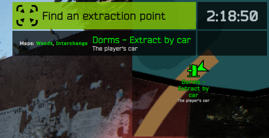

# Path To Tarkov config specification

This is the reference to all available Path To Tarkov config properties.

It references all ptt features that can be used in `config.json5` files.

For the documentation about `UserConfig.json5` file, there is a separate one. (check in useful links below)

Useful links:
- [UserConfig documentation (UserConfig.json5)](./USER_CONFIG_DOCUMENTATION.md)
- [Tutorial: create a config from scratch](../TUTORIAL_CONFIG.md)
- [List of available exfils (ALL_EXFILS.md)](../../ALL_EXFILS.md)
- [List of player spawnpoints (shared_player_spawnpoints.json5)](../../configs/shared_player_spawnpoints.json5)

## Terminology
- **offraid position**: fictive place defined in the config, you can name it like you want
- **infiltration**: target map + player spawnpoint
- **exfiltration**: in-raid zone when you can perform extract or transit
- **extract**: stop the game and move the player to a specific offraid position
- **transit**: load the next map without saving the offraid position

## Specification

### `initial_offraid_position` (string)
This property is mandatory!

It need to be a valid offraid position name, the position should exist in the `infiltrations` section of the config.

This property will be used to set the offraid position when:
- first startup with ptt
- when current player offraid position is unknown (due to a config change for example)
- when player die (only if `respawn_at` is not defined)

```js
initial_offraid_position: 'MyInitialOffraidPosition', // this offraid position should be defined in `infiltrations`
```

### `respawn_at` (string[])
Optional property to differentiate init and death.

An array of offraid positions is needed here, it will randomize the respawn offraid position on player death.

```js
respawn_at: ["OffraidPosition1", "OffraidPosition2"]
```

### `hideout_main_stash_access_via` (string[])
Define the offraid positions for accessing the main player hideout here.

This section can be skipped if the `hideout_multistash_enabled` feature is disabled.

```js
// here the main stash will be accessible
hideout_main_stash_access_via: ["MyInitialOffraidPosition", "MySecondPosition"],
```

### `hideout_secondary_stashes` (StashConfig[])
An array of secondary stash configuration.

Avoid renaming the ID of the stash after the config has been shipped to players, as it will break item and stash associations, causing players to lose items in secondary stashes.

```js
hideout_secondary_stashes: [
  {
    id: 'my_stash_1', // avoid renaming this id
    size: 8, // this the height of the stash
    access_via: ['MyOffraidPosA', 'MyOffraidPosB'],
  },
  {
    id: 'my_stash_2',
    size: 18,
    access_via: ['MyOffraidPosC'],
  },
],
```

### `infiltrations` (Infiltrations)
This is one of the most important property of a ptt config.

This is the place where mapping between offraid positions and maps/spawns occurs

```js
// Define all offraid positions and their corresponding infiltrations by map here.
infiltrations: {
  // "OffraidPosition1" is the chosen name of the offraid position here
  // for setting a display name, please consider using `offraid_positions` property in config
  OffraidPosition1: {
    bigmap: ['Dorms Car'], // "Dorms Car" is the name of the spawnpoint in `shared_player_spawnpoints.json5`
    woods: ['Woods Vehicle Extract'], // "Woods Vehicle Extract" is the name of the spawnpoint in `shared_player_spawnpoints.json5`
    interchange: ['Interchange Vehicle Extract'], // "Interchange Vehicle Extract" is the name of the spawnpoint in `shared_player_spawnpoints.json5`
  },
  OffraidPosition2: {
    bigmap: ['*'], // wildcard '*' is used here to let the game choose a random player spawnpoints (vanilla behaviouyr) 
    woods: ['ZB-014', 'ZB-016'], // it will pick a random spawn in the list
  },
},
```

### `exfiltrations` (Exfiltrations)
This is the place where extract/transits can be configured.

```js
// Here is where you define your exil target for a given exfil name (by map)
// You can find a complete list of vanilla exfils in ALL_EXFILS.md
exfiltrations: {
  bigmap: {
    // here we used 2 offraid positions and 2 transits for 1 exfil, it means the player can choose a target exifl using the prompt
    'Dorms V-Ex': [
      'ThePlayerCar', // extract to offraid position
      'TheHiddenHouse', // extract to offraid position
      'interchange.Interchange Vehicle Extract', // transit to interchange
      'woods.Woods Vehicle Extract', // transit to woods
    ],
  },

  interchange: {
    // yes "PP Exfil" is the BSG name for the car exfil on interchange
    'PP Exfil': ['ThePlayerCar'],
  },
  woods: {
    'South V-Ex': ['ThePlayerCar'],
  },
},
```


### `traders_config` (TradersConfig)
Configure traders access restriction, override traders location description, insurance and more...

Here is a first basic example took from the config tutorial:

```js
traders_config: {
  // Prapor
  '54cb50c76803fa8b248b4571': {
    access_via: ['ThePlayerCar'],
  },
  // Therapist
  '54cb57776803fa99248b456e': {
    access_via: ['ThePlayerCar'],
  },
  // Mechanic
  '5a7c2eca46aef81a7ca2145d': {
    access_via: ['ThePlayerCar'],
  },
  // Skier
  '58330581ace78e27b8b10cee': {
    access_via: ['ThePlayerCar'],
  },
  // Ragman
  '5ac3b934156ae10c4430e83c': {
    access_via: ['TheHiddenHouse'],
  },
  // Jaeger
  '5c0647fdd443bc2504c2d371': {
    access_via: ['TheHiddenHouse'],
  },
  // Peacekeeper
  '5935c25fb3acc3127c3d8cd9': {
    access_via: ['TheHiddenHouse'],
  },
  // Fence
  '579dc571d53a0658a154fbec': {
    access_via: [], // fence is completely disabled here
  },
  // You can also restrict access to modded traders, search for the `_Id` property in the `base.json` of your modded trader
  // Painter
  '668aaff35fd574b6dcc4a686': {
    disable_warning: true, // this option will prevent warning to be displayed in the server console (this is in case the uplayer don't have installed the modded trader)
    access_via: ['TheHiddenHouse'],
  },
},
```

Here is a second example that will show every possible fields for one trader.

```js
traders_config: {
  // Fence
  '579dc571d53a0658a154fbec': {
    access_via: ['*'], // the wildcard '*' is used to specify that the trader should be available everywhere
    insurance_always_enabled: true, // enable insurance service for this trader
    insurance_config: { // configure the insurance service
      insurance_price_coef: 25,
      min_payment: 0,
      min_return_hour: 0,
      max_return_hour: 0,
      max_storage_time: 480,
      return_chance_percent: 50,
    },
    repair_always_enabled: true, // enable the repair service
    repair_config: { // configure the repair service
      quality: 1,
      currency: '5449016a4bdc2d6f028b456f',
      currency_coefficient: 12,
      repair_price_coef: 0,
    },
    heal_always_enabled: true, // configure the medic service (ability to heal at the end of a raid)
  },
},
```


### `infiltrations_config` (InfiltrationsConfig)
It allows more configuration on infils like adding custom spawnpoints.

```js
infiltrations_config: {
  additional_player_spawnpoints: {
    woods: {
      ScavVillage: {
        // Scav Village in the north end
        Position: [-58.53, 7.66, -757.22],
        Rotation: 180,
      },
    },
  },
},
```

### `exfiltrations_config` (ExfiltrationsConfig)
It allows more configuration on exfils like:
- rename extract names: This will interact well with the `exfiltrations_tooltips_template` feature
- override the exfil template for a specific exfil
- setup exfils requirements: NOT IMPLEMENTED YET


```js
exfiltrations_config: {
  bigmap: {
    // You can find a complete list of vanilla exfils in ALL_EXFILS.md
    'Dorms V-Ex': {
      displayName: { // it will override the $exfilDisplayName variable in `exfiltrations_tooltips_template`
        en: 'Dorms - Extract by car',
        fr: 'Dortoirs - Extraction en voiture',
        // other languages...
      },
      // This override will change the size and the color of the exfil name.
      // Note: the "$offraidPositionDisplayName" variable is not used here (so it won't be displayed)
      override_tooltips_template: '<color="yellow"><size=75%>$exfilDisplayName',
    },
  },
},
```

### `offraid_positions` (OffraidPositions)
It allows more configuration on offraid position like the ability to give them a display name.
Defining `offraid_positions` is optional but PTT will warns users for missing offraid position definition.

```js
offraid_positions: {
  OffraidPosition1: {
    displayName: {
      en: "The player's car",
      fr: 'La voiture du joueur',
      // other languages...
    },
  },
  OffraidPosition2: {
    displayName: {
      en: 'Hidden house near crossroads',
      fr: "Maison cachée près d'un carrefour",
    },
  },
},
```

### `offraid_regen_config` (OffraidRegenConfig)
Setup restrictions health/energy/hydration according to the offraid position.
By default, everything is available everywhere.

```js
offraid_regen_config: {
  hydration: {
    // the wildcard '*' means it's accessible from everywhere (this is the default value)
    access_via: ['*'],
  },
  energy: {
    // no energy regen at all
    access_via: [],
  },
  health: {
    // health regen will be accessible only at this offraid position
    access_via: ['MyOwnTherapistHideout'],
  },
},
```

### `restrictions_in_raid` (InRaidRestrictions)
By default, the game limits the amount of money that can be brought into a raid. This limitation is unnecessary in PTT, so a QoL feature is provided to adjust restriction limits for any items in the game.

```js
restrictions_in_raid: {
  // roubles
  '5449016a4bdc2d6f028b456f': {
    Value: 100000000,
  },
  // dollars
  '5696686a4bdc2da3298b456a': {
    Value: 1000000,
  },
  // euros
  '569668774bdc2da2298b4568': {
    Value: 1000000,
  },
  // case key
  '67449b6c89d5e1ddc603f504': {
    Value: 42,
  },
  // locked case
  '6740987b89d5e1ddc603f4f0': {
    Value: 10,
  },
},
```

### `exfiltrations_tooltips_template` (string)

[Unity rich text](https://docs.unity3d.com/Packages/com.unity.ugui@1.0/manual/StyledText.html) can be used here, along with available variables, to customize the exfil tooltip format.

The available variables are
- `$exfilDisplayName`: the exfiltration point name (will also work with renamed exfils configured in `exfiltrations_config`)
- `$offraidPositionDisplayName`: the name of the first found target offraid position for this exfil

Here is the tooltip template used in the default config: 

```js
exfiltrations_tooltips_template: '<color="green"><size=90%>$exfilDisplayName\n<size=60%><color="white">$offraidPositionDisplayName',
```

This also affects how it is displayed on dynamic maps, as shown in the above example.



Notes:
- By default the `exfiltrations_tooltips_template` is `$exfilDisplayName`
- `\n` can be used to break lines

### `extracts_prompt_template` (LocalizedString)
extract prompt can be renamed/translated

```js
extracts_prompt_template: {
  en: 'Extract to {0}',
  fr: 'Extraction vers {0}',
  ch: 'Extract to {0}', // seeking help for translation
  cz: 'Extract to {0}', // seeking help for translation
  'es-mx': 'Extract to {0}', // seeking help for translation
  es: 'Extract to {0}', // seeking help for translation
  ge: 'Extract to {0}', // seeking help for translation
  hu: 'Extract to {0}', // seeking help for translation
  it: 'Extract to {0}', // seeking help for translation
  jp: 'Extract to {0}', // seeking help for translation
  kr: 'Extract to {0}', // seeking help for translation
  pl: 'Extract to {0}', // seeking help for translation
  po: 'Extract to {0}', // seeking help for translation
  ro: 'Extract to {0}', // seeking help for translation
  ru: 'Extract to {0}', // seeking help for translation
  sk: 'Extract to {0}', // seeking help for translation
  tu: 'Extract to {0}', // seeking help for translation
},
```

### `transits_prompt_template` (LocalizedString)
transit prompt can be renamed/translated

```js
transits_prompt_template: {
  en: 'Transit to {0}',
  fr: 'Transit vers {0}',
  ch: 'Transit to {0}', // seeking help for translation
  cz: 'Transit to {0}', // seeking help for translation
  'es-mx': 'Transit to {0}', // seeking help for translation
  es: 'Transit to {0}', // seeking help for translation
  ge: 'Transit to {0}', // seeking help for translation
  hu: 'Transit to {0}', // seeking help for translation
  it: 'Transit to {0}', // seeking help for translation
  jp: 'Transit to {0}', // seeking help for translation
  kr: 'Transit to {0}', // seeking help for translation
  pl: 'Transit to {0}', // seeking help for translation
  po: 'Transit to {0}', // seeking help for translation
  ro: 'Transit to {0}', // seeking help for translation
  ru: 'Transit to {0}', // seeking help for translation
  sk: 'Transit to {0}', // seeking help for translation
  tu: 'Transit to {0}', // seeking help for translation
},
```

### `enable_automatic_transits_creation` (boolean)
```js
// all configured exfils will be adjusted to automatically add corresponding transits (according to the config)
// this is turned on in the Default PTT config
enable_automatic_transits_creation: true
```

```js
// will do nothing to configured exfils
enable_automatic_transits_creation: false
```

### `override_by_profiles` (OverrideByProfiles)
**Experimental**: This will allow to override some config values based on the current user profile.

Take a look to the [Examples/OverrideByProfiles](../../configs//Examples/OverrideByProfiles/config.json5) config to see how to use it.

### `enable_all_vanilla_transits` (boolean)
**Experimental**: Enabling this is not recommended, as vanilla transits are unsupported by PTT. However, it is still possible to enable if desired.

### `debug_exfiltrations_tooltips_locale`(string)
This prints in the server console the formatted tooltip for each exfils.

it will help debug the formatted tooltip for each exfils (related to `exfiltrations_tooltips_template` and `exfiltrations_config`)

```js
debug_exfiltrations_tooltips_locale: "en"; // any valid EFT locales can be used here
```
