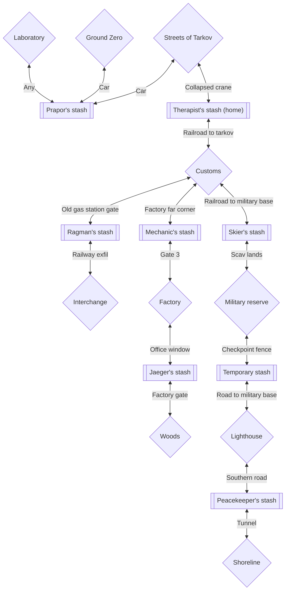

```mermaid
flowchart TD
    Lab{Laboratory}
    GZ{Ground Zero}
    Streets{Streets of Tarkov}
    I{Interchange}
    C{Customs}
    F{Factory}
    W{Woods}
    R{Military reserve}
    L{Lighthouse}
    Shoreline{Shoreline}

    Prapor[[Prapor's stash]]
    Therapist[["Therapist's stash (home)"]]
    Mechanic[[Mechanic's stash]]
    Ragman[[Ragman's stash]]
    Skier[[Skier's stash]]
    Peacekeeper[[Peacekeeper's stash]]
    Jaeger[[Jaeger's stash]]
    TmpStash[[Temporary stash]]

    Lab <--Any--> Prapor
    GZ <--Car--> Prapor
    Streets <--Car--> Prapor
    Streets <--Collapsed crane--> Therapist <--Railroad to tarkov--> C
    C <--Railroad to military base--> Skier <--Scav lands--> R
    R <--Checkpoint fence--> TmpStash <--Road to military base--> L
    L <--Southern road--> Peacekeeper <--Tunnel--> Shoreline

    C <--Old gas station gate--> Ragman <--Railway exfil--> I
    C <--Factory far corner--> Mechanic <--Gate 3--> F
    F <--Office window--> Jaeger <--Factory gate--> W
```